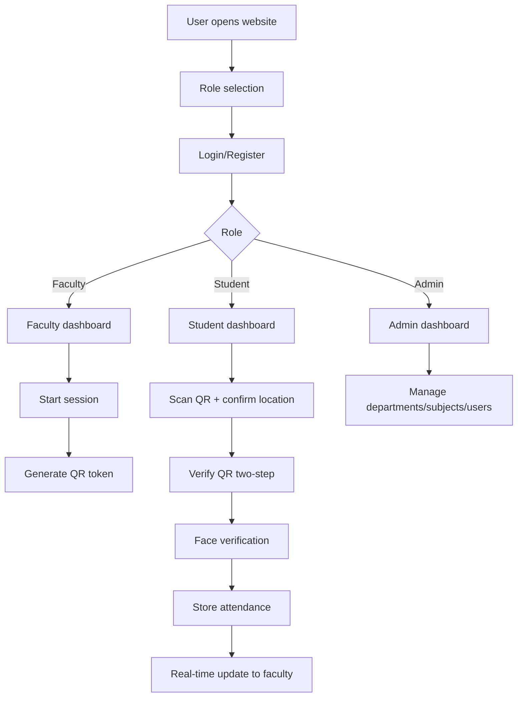
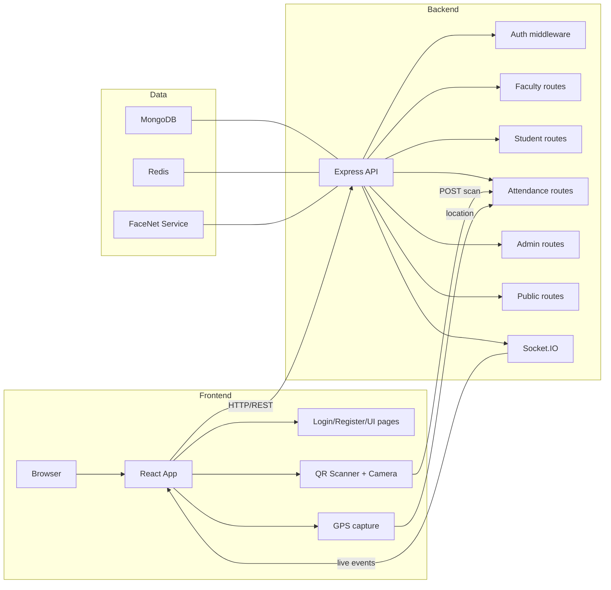
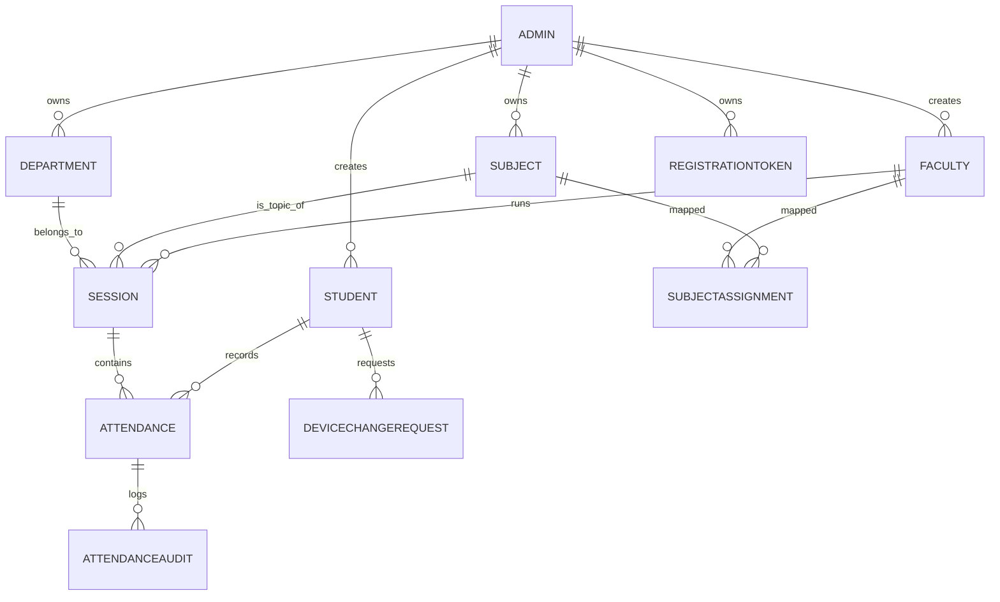
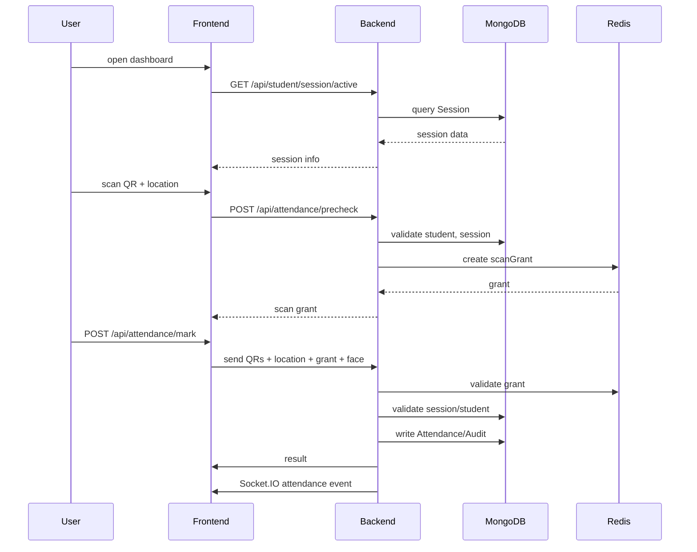
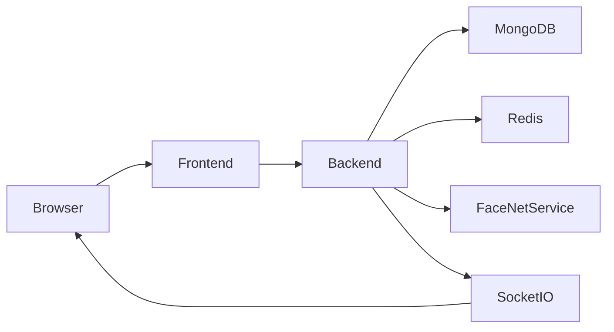
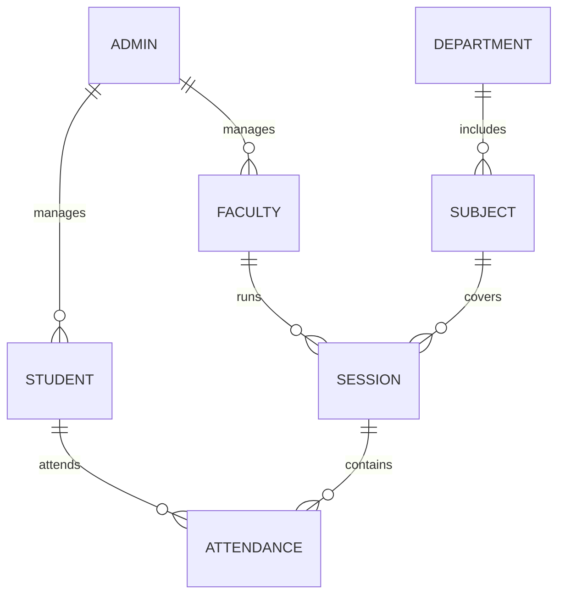
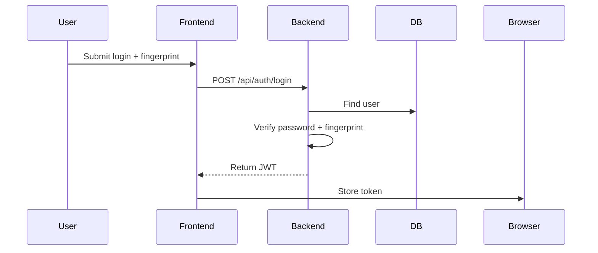
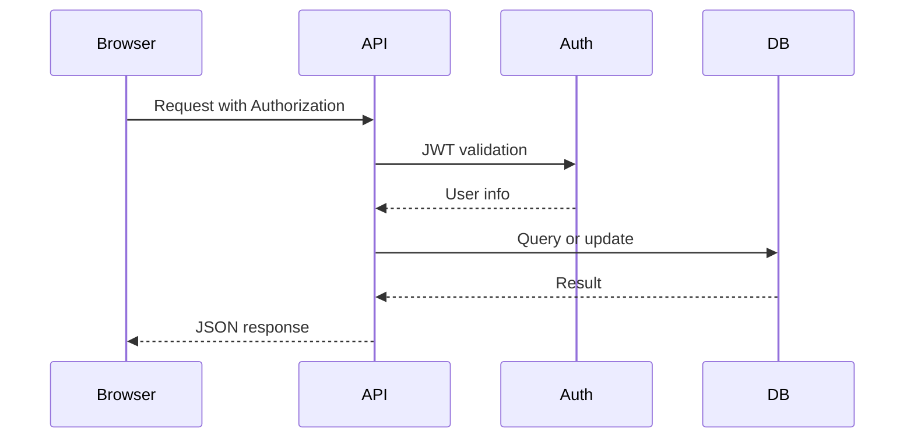
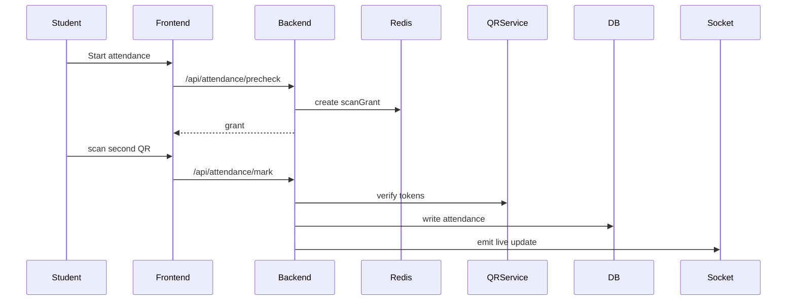

# SmartAttendenceSystem - Technical Documentation

## 1. Project Overview

### Project Name
SmartAttendenceSystem

### Problem Statement
Traditional attendance systems in academic institutions rely on manual roll calls, static QR code scans, or paper logs. These methods are vulnerable to proxy attendance, code sharing, device spoofing, and inaccurate location validation.

### Real-world Problem
Educational institutions need a secure, automated attendance solution that verifies the actual student, device, and location before marking attendance.

### Why this project exists
This project was built to reduce attendance fraud, save faculty time, and provide reliable attendance records by combining dynamic QR codes, device fingerprinting, geolocation validation, face verification, and real-time dashboards.

### Target Users
- Administrators
- Faculty members
- Students

### Industry Use Case
Higher education campuses, coaching centers, training institutes, and exam centers.

### Objectives
- Automate classroom attendance.
- Prevent proxy attendance.
- Provide role-specific dashboards.
- Store attendance securely.
- Enable expiration-based attendance sessions.
- Support mobile location capture and device management.

### Expected Outcomes
- Reliable attendance capture.
- Reduced fraud.
- Faster faculty workflows.
- Accurate attendance reporting.
- Multi-layer verification.

### Scope
- Web-based frontend using React + TypeScript.
- Backend built with Node.js + Express.
- MongoDB data storage.
- Device fingerprinting, QR sessions, location checks, face verification.
- Role-based access control.

### Limitations
- Face verification requires camera support and browser compatibility.
- GPS validation depends on device accuracy.
- Some security features require Redis for production scaling.
- Deployment requires correct environment configuration and SSL for production.

---

## 2. Complete Project Workflow

### High-level Workflow
1. User opens web app.
2. User chooses role: Admin / Faculty / Student.
3. Authentication with email/password and device fingerprint.
4. Role-based dashboard loads.
5. Faculty starts attendance session.
6. Backend generates rotating QR token.
7. Student scans QR, validates location, and verifies face.
8. Backend confirms QR sequence, session eligibility, location, device fingerprint, and optional face match.
9. Attendance is recorded in MongoDB.
10. Faculty dashboard updates in real time.

### Workflow Diagram

### Backend Process Flow
- Express server receives API requests.
- JWT middleware authenticates requests and extracts role.
- Business route handlers enforce role-based authorization.
- Session creation updates MongoDB.
- QR tokens are signed and validated with `QR_SECRET`.
- Redis is used for ephemeral state when configured.
- Attendance writes include audit records.

### Database Interaction
- `Admins`, `Faculty`, `Students` store user identities.
- `Departments`, `Subjects`, `RegistrationTokens` capture academic structure.
- `Session` stores active attendance sessions.
- `Attendance` and `AttendanceAudit` record outcomes.

---

## 3. End-to-End Working Flow

### Example: Student Attendance Marking
1. Student opens dashboard.
2. Student fetches active session and session QR from backend.
3. Student starts location capture.
4. Frontend reads GPS coordinates and accuracy.
5. Frontend sends `/api/attendance/precheck`.
6. Backend validates student role, location, session eligibility, and device fingerprint.
7. Backend issues a one-time `scanGrant` token.
8. Student scans two consecutive QR tokens.
9. Frontend sends `/api/attendance/mark` with first and second QR tokens, location, fingerprint, and face payload.
10. Backend verifies QR validity, two-step sequence, session active status, grant validity, device match, and location.
11. Backend optionally verifies face data.
12. Backend writes `Attendance` and `AttendanceAudit`.
13. WebSocket emits live attendance update.
14. Student receives confirmation.

### Example: Faculty Session Creation
1. Faculty logs in.
2. Faculty chooses subject, department, class, and location.
3. Frontend calls `/api/faculty/session/start`.
4. Backend verifies faculty permissions and subject allotment.
5. Backend creates a `Session` record.
6. Backend returns the current QR token.
7. Frontend shows rotating QR.
8. Faculty monitors live counts via Socket.IO.

---

## 4. System Architecture

### Components
- Frontend: React + TypeScript + Vite.
- Backend: Node.js + Express.
- Database: MongoDB with Mongoose.
- Realtime: Socket.IO.
- Authentication: JWT.
- Device validation: fingerprint hash.
- Face verification: client-side face signature + optional FaceNet service.
- Optional external service: Python face-service for embeddings.

### Architecture Diagram

### Services
- `apiClient.ts`: frontend API wrapper.
- `attendanceClient.ts`: fingerprint and attendance utilities.
- `faceSignature.ts`: generates compact face signatures.
- `LivePhotoCapture.tsx`: camera capture and quality gating.
- `createSocket.js`: Socket.IO setup.
- `qrService.js`: QR token generation & validation.
- `locationValidation.js`: geofence distance checks.
- `faceVerification.js`: face match logic.

---

## 5. Technology Stack

| Technology | Purpose | Why Selected | Advantages | Alternatives | Learning Value | Example |
|---|---|---|---|---|---|---|
| React | Frontend UI | Component-driven single-page app | Fast rendering, component reuse | Vue, Angular | Modern web apps | `App.tsx` |
| TypeScript | Strong typing | Safer code and editor tooling | Fewer runtime bugs | JavaScript | Type-safe React | `src/types.ts` |
| Vite | Build and dev server | Fast startup, modern tooling | Instant reload | Webpack | Modern frontend build | `vite.config.ts` |
| Node.js | Backend runtime | Large ecosystem | Performance, JavaScript reuse | Python, Java | Server-side JS | `server/index.js` |
| Express | API framework | Minimal routing | Easy middleware | Fastify, Koa | REST APIs | `server/routes/auth.js` |
| MongoDB | NoSQL DB | Flexible documents | Quick schema iteration | PostgreSQL | Document data | `server/models/` |
| Mongoose | ODM | Schema modeling | Validation + relations | Prisma, native driver | Schema enforcement | `server/models/Student.js` |
| JWT | Authentication | Stateless auth | Simple token handling | OAuth2 | Auth design | `server/routes/auth.js` |
| bcryptjs | Password security | Hashing passwords | Proven library | argon2 | Password safety | `server/models/Faculty.js` |
| Socket.IO | Realtime updates | Live attendance | Built-in rooms | WebSockets | Realtime UI | `server/sockets/createSocket.js` |
| html5-qrcode | QR scanning | Browser QR scan | No native app | ZXing | QR capture | `CameraQrScanner.tsx` |
| react-qr-code | QR generation | Display token QR | Easy rendering | qrcode.react | QR UI | `FacultyDashboard.tsx` |
| Redis | Ephemeral state | Shared state for clustering | Fast cache | Memcached | Distributed state | `server/services/redisClient.js` |
| Docker Compose | Deployment | Local infra | Multi-container dev | Kubernetes | Container orchestration | `docker-compose.yml` |

---

## 6. Folder Structure

### Root
- `package.json`: frontend dependencies and scripts.
- `vite.config.ts`: Vite config.
- `README.md`, `README_UPDATED.md`, `QUICK_REFERENCE.md`, `ARCHITECTURE_UPGRADE_REPORT.md`: documentation.
- `docker-compose.yml`: local MongoDB/Redis compose.
- `face-service/`: optional Python face embedding service.
- `server/`: backend.
- `src/`: frontend.
- `public/`: static assets.

### `server/`
- `index.js`: app entrypoint.
- `config/db.js`: MongoDB connection and index sync.
- `middleware/`: auth, admin auth, rate limiting.
- `models/`: Mongoose schemas.
- `routes/`: API endpoints.
- `services/`: business/services layer.
- `sockets/`: Socket.IO setup.
- `utils/`: helper utilities.

### `src/`
- `App.tsx`: single-page entry.
- `index.tsx`: client bootstrap.
- `store.tsx`: app state management.
- `types.ts`: type definitions.
- `components/`: reusable UI.
- `pages/`: major role workflows.
- `services/`: API and domain clients.
- `utils/`: helper functions.

---

## 7. Frontend Architecture

### Pages
- `Login.tsx`: multi-role login and device change request flow.
- `Register.tsx`: registration for student/faculty/admin.
- `AdminDashboard.tsx`: admin management and analytics.
- `FacultyDashboard.tsx`: session controls, QR display, location capture.
- `StudentDashboard.tsx`: session list, attendance status, scan flow.
- `MobileLocationCapture.tsx`: public location capture flow.

### Components
- `HeaderBar.tsx`: navigation and role indicator.
- `CollegeHeader.tsx`: branding header.
- `CameraQrScanner.tsx`: QR scanning UI.
- `LivePhotoCapture.tsx`: camera + face quality capture.
- `AppLogo.tsx`: branding.
- `Common.tsx`: buttons, cards, inputs.

### Reusable Components
- `Button`, `Input`, `Card`, `Badge`.
- `LivePhotoCapture` for face capture / verification.
- `CameraQrScanner` for QR scanning.

### State Management
- `store.tsx` uses React context/state for view navigation.
- `apiClient.ts` stores `authToken` in localStorage.

### Routing
- Client-side view switching in `App.tsx`.
- URL path `/mobile-location` bypasses default layout.
- Registration token is passed via query string.

### Authentication
- JWT stored in localStorage.
- `apiClient` attaches `Authorization: Bearer` header.
- Logout clears token.

### Services
- `apiClient.ts`: request helper.
- `attendanceClient.ts`: fingerprint and specialized service functions.
- `facultySession.ts`: faculty route helper.

### Utilities
- `faceSignature.ts`: generates face signatures with a 16x16 grid.
- `liveLocation.ts`: browser location watch.
- `imageCapture.ts`: camera frame capture.
- `faceApiLoader.ts`, `mediaPipeFaceQuality.ts`, `faceMovementLiveness.ts`: client face quality/liveness.

### Forms
- Login, registration, session creation, device change request.
- Validate required fields before submit.

### Error handling
- API errors surfaced to user.
- Timeout handling in `apiClient.request`.

### Optimization
- Code splitting with `React.lazy`.
- Suspense loading placeholder.

---

## 8. Backend Architecture

### Routes
- `server/routes/auth.js`: login, device change verification, request.
- `server/routes/admin.js`: admin creation, registration token, users.
- `server/routes/faculty.js`: faculty session lifecycle, analytics, device requests.
- `server/routes/student.js`: student registration, dashboard data, attendance overview.
- `server/routes/attendance.js`: precheck, manual attendance, QR mark, history.
- `server/routes/department.js`: department management.
- `server/routes/subject.js`: subject management and allotment.
- `server/routes/public.js`: registration token lookup, mobile location capture.

### Middleware
- `auth.js`: JWT validation and role injection.
- `adminAuth.js`: admin-only access.
- `authMiddleware.js`: standard authentication.
- `rateLimit.js`: request throttling.

### Models
- `Admin`, `Faculty`, `Student`, `Department`, `Subject`, `Session`, `Attendance`, `AttendanceAudit`, `RegistrationToken`, `DeviceChangeRequest`, `SubjectAssignment`.

### Services
- `qrService.js`: QR token lifecycle.
- `locationValidation.js`: geofence checks.
- `faceVerification.js`: verifies face signature or optional FaceNet.
- `faceEmbeddingService.js`: optional embedding service.
- `deviceFingerprint.js`: fingerprint normalization.
- `mobileLocationCapture.js`: public location capture storage.
- `sessionLifecycle.js`: expire/touch sessions.
- `redisClient.js`: Redis helper.
- `studentTodayAttendance.js`: student attendance summary/analytics.

### Utilities
- `getLocalIP.js`: host IP discovery.

### Authentication / Authorization
- JWT tokens are signed with `JWT_SECRET`.
- Role-based checks differentiate student, faculty, admin.
- Student/faculty login requires device fingerprint.
- Admin login only uses password.

### Business Logic
- Dynamic QR generation for active sessions.
- Two-step QR validation.
- Location precheck and scan grant issuance.
- Attendance write with transaction fallback.

### Validation
- Device fingerprint verification.
- Session eligibility by year/semester/section/department.
- GPS accuracy thresholds.
- QR token issuer/audience checks.
- Registration token expiry and uses.

### Error handling
- Central error middleware returns 500 on unhandled errors.
- Route-specific validation errors return descriptive messages.
- Redis state failures return 503.

### Logging
- Console logs for startup, errors, socket auth.

### Configuration
- `.env` variables: `MONGO_URI`, `JWT_SECRET`, `QR_SECRET`, `FRONTEND_URL`, `REDIS_URL`, `PORT`, `HOST`, `SSL_KEY_PATH`, `SSL_CERT_PATH`, `SYNC_INDEXES`, `MONGO_AUTO_INDEX`, `QR_TTL_SECONDS`, etc.

---

## 9. Database Design

### Collections / Tables
- `Admin`
- `Faculty`
- `Student`
- `Department`
- `Subject`
- `RegistrationToken`
- `Session`
- `Attendance`
- `AttendanceAudit`
- `DeviceChangeRequest`
- `SubjectAssignment`

### Relationships
- Student and Faculty are created by Admin.
- Session references Faculty, Subject, and Department.
- Attendance references Session, Student, Faculty, Subject.
- RegistrationToken belongs to Admin.

### ER Diagram

### Fields Overview
#### Admin
- `name`, `email`, `passwordHash`, `collegeName`, `profilePhotoUrl`.

#### Faculty
- `name`, `email`, `passwordHash`, `department`, `deviceFingerprint`, `deviceLockEnabled`, `createdByAdmin`, `allottedSubjects`.

#### Student
- `name`, `email`, `passwordHash`, `enrollmentNo`, `year`, `semester`, `section`, `department`, `deviceFingerprint`, `createdByAdmin`, `collegeName`, `profilePhotoUrl`, face signature / embedding fields, `registeredViaToken`.

#### Session
- `faculty`, `subject`, `year`, `semester`, `section`, `department`, `startTime`, `lastActivityAt`, `endTime`, `location`, `isActive`.

#### Attendance
- `session`, `student`, `faculty`, `subject`, `timestamp`, `status`, `location`, `deviceFingerprint`, `faceVerification`.

#### AttendanceAudit
- `attendance`, `session`, `student`, `faculty`, `subject`, `action`, `method`, `actorRole`, `actor`, `deviceFingerprint`, `location`, `qr`, `faceVerification`, `requestMeta`.

#### RegistrationToken
- `token`, `type`, `adminId`, `collegeName`, `expiresAt`, `maxUses`, `usesCount`, `isActive`, `lastUsedAt`.

---

## 10. Authentication Flow

### Registration
- Admin registers directly.
- Admin generates registration tokens for student or faculty.
- Student/faculty register via `/api/public/departments` and `/api/student/register` or `/api/faculty/register`.
- Registration token validates expiry and max uses.

### Login
- `POST /api/auth/login` with role, email, password, fingerprint.
- Admin only requires password.
- Students and faculties require device fingerprint if device lock is enabled.
- JWT token valid for 7 days.

### JWT
- Signed with `JWT_SECRET`.
- Contains `id`, `role`, `email`.
- Used in route auth and Socket.IO auth.

### Sessions
- Backend does not use refresh tokens.
- JWT stored in localStorage by frontend.

### Authorization
- `authMiddleware` verifies JWT and attaches `req.userId`, `req.userRole`.
- `adminAuth` restricts admin-only routes.
- Route handlers check `req.userRole`.

### Device Management
- Fingerprint is normalized and stored on registration.
- Students and faculty login checks fingerprint match.
- Device change requests are routed through verification and faculty review.

### Security
- Passwords hashed via bcrypt.
- JWT used for stateless auth.
- Role checks prevent unauthorized access.

---

## 11. Feature-wise Explanation

### Admin Features
- Create admin account.
- Generate registration links for students/faculty.
- View all created users.
- Manage departments and subjects.
- Toggle faculty device lock.
- View student analytics.

### Faculty Features
- Register via token link.
- Start/stop/cancel attendance sessions.
- Generate rotating QR for live session.
- Monitor live attendance via Socket.IO.
- Create mobile location capture requests.
- Review device change requests.
- Fetch subject analytics.

### Student Features
- Register via token link.
- Login from bound device.
- Capture QR and location.
- Submit face verification.
- Mark attendance with two-step QR.
- View current and recent attendance.

### Attendance Flow
- `precheck` verifies location and issues scan grant.
- `mark` verifies two QR tokens and consumes grant.
- `manual` allows faculty/admin to correct attendance.
- `AttendanceAudit` stores full audit trail.

### Device Change Flow
- Student verifies credentials via `/device-change/verify-student`.
- Student submits request with live selfie and fingerprint.
- Faculty/admin reviews request.

### Registration Flow
- Admin issues token with expiry and use count.
- Public route returns departments.
- Student or faculty registers with token.
- Registration token uses count increments.

---

## 12. API Documentation

### Authentication
| Method | Endpoint | Purpose | Headers | Body | Response |
|---|---|---|---|---|---|
| POST | `/api/auth/login` | Authenticate user | `Authorization` optional | `{ role, email, password, fingerprint }` | `{ ok, token, user }` |
| POST | `/api/auth/device-change/verify-student` | Start device change flow | - | `{ email, password }` | `{ ok, verifyToken, student }` |
| POST | `/api/auth/device-change/request` | Submit device change request | - | `{ verifyToken, fingerprint, selfieDataUrl }` | `{ ok, request }` |

### Admin
| Method | Endpoint | Purpose | Body | Auth |
|---|---|---|---|---|
| POST | `/api/admin/create-admin` | Create admin | `{ name, email, password, collegeName }` | none |
| PUT | `/api/admin/profile` | Update admin profile | `{ collegeName, profilePhotoUrl }` | Admin |
| POST | `/api/admin/generate-registration-link` | Create registration token | `{ type, expiryHours, maxRegistrations }` | Admin |
| GET | `/api/admin/users` | List admin users | - | Admin |
| PUT | `/api/admin/faculty/:facultyId/device-lock` | Toggle device lock | `{ enabled }` | Admin |

### Faculty
| Method | Endpoint | Purpose | Body | Auth |
|---|---|---|---|---|
| POST | `/api/faculty/session/start` | Start attendance session | `{ subjectId, departmentId, location, year, semester, section }` | Faculty/Admin |
| POST | `/api/faculty/session/:id/stop` | Stop session | - | Faculty/Admin |
| POST | `/api/faculty/session/:id/cancel` | Cancel session & delete attendance | - | Faculty/Admin |
| GET | `/api/faculty/session/:id/qr` | Get current QR token | - | Faculty/Admin |
| GET | `/api/faculty/subjects/:subjectId/analytics` | Get analytics | Query: `classCode` | Faculty |
| GET | `/api/faculty/device-change-requests` | List requests | `status` | Faculty |
| POST | `/api/faculty/device-change-requests/:id/review` | Review request | `{ decision, reviewNote }` | Faculty |

### Student
| Method | Endpoint | Purpose | Body | Auth |
|---|---|---|---|---|
| POST | `/api/student/register` | Student registration | `{ token, name, email, password, enrollmentNo, year, semester, section, departmentId, fingerprint, profilePhotoUrl, faceSignature, faceSignatureMirror, faceSignatureVersion }` | none |
| GET | `/api/student/session/active` | Get active session | - | Student |
| GET | `/api/student/sessions/today` | Today's sessions | - | Student |
| GET | `/api/student/sessions/recent` | Recent sessions | `limit` | Student |
| GET | `/api/student/attendance/today-live` | Today's live attendance | - | Student |
| GET | `/api/student/attendance/overview` | Attendance overview | - | Student |

### Attendance
| Method | Endpoint | Purpose | Body | Auth |
|---|---|---|---|---|
| POST | `/api/attendance/precheck` | Validate location + issue scan grant | `{ locationQrPayload, sessionId, lat, lng, accuracy, fingerprint }` | Student |
| POST | `/api/attendance/mark` | Mark attendance | `{ firstQrToken, secondQrToken, lat, lng, accuracy, fingerprint, scanGrant, faceVerification }` | Student |
| POST | `/api/attendance/manual` | Manual present/absent | `{ sessionId, enrollmentNo, status }` | Faculty/Admin |
| GET  | `/api/attendance` | Fetch attendance records | query filters | Faculty/Admin/Student |

### Public
| Method | Endpoint | Purpose | Parameters | Auth |
|---|---|---|---|---|
| GET | `/api/public/departments?token=` | Validate registration token | `token` | none |
| GET | `/api/public/mobile-location/:token` | Retrieve mobile capture status | token | none |
| POST | `/api/public/mobile-location/:token` | Submit mobile location | `{ lat, lng, accuracy, deviceLabel }` | none |

### Errors
- `400`: validation or bad request.
- `401`: unauthorized or invalid credentials.
- `403`: forbidden or device mismatch.
- `404`: resource not found.
- `500`: internal server error.
- `503`: Redis unavailable for stateful features.

---

## 13. UI Flow

### Login Page
- Role selection: Admin / Faculty / Student.
- Email/password inputs.
- Fingerprint captured client-side.
- Device change flow for students.

### Registration Page
- Registration link token required for student/faculty.
- Department selection.
- Student registration includes face photo capture and signature build.

### Admin Dashboard
- Create departments and subjects.
- Generate registration links.
- View users and analytics.

### Faculty Dashboard
- Start sessions with subject, location, year/semester/section.
- View rotating QR.
- Monitor live attendance.
- Manage device change requests.

### Student Dashboard
- View active session and attendance status.
- Capture location.
- Scan QR in two steps.
- Submit face verification.
- See attendance history.

---

## 14. Business Logic

### QR Generation
- `QR_TTL_SECONDS` sets short QR lifetime.
- QR tokens signed by `QR_SECRET`.
- QR payload includes `sessionId`, `facultyId`, `subjectId`, `location`.
- Recent tokens are tracked to enforce two-step scanning.

### Two-Step QR Validation
- Both QR tokens are validated with `verifyQRToken`.
- Tokens must belong to same session.
- Second QR must be newer and within gap limit.
- `validateTwoStepQR` checks token hash sequence.

### Session Eligibility
- Student year/semester/section must match session.
- Department must match session department or subject departments.
- Subject must belong to institution.

### Location Validation
- Uses haversine distance.
- `LOCATION_BASE_TOLERANCE_METERS` plus GPS accuracy margin.
- Rejects if outside allowed radius.

### Device Fingerprinting
- Stored as SHA-256 normalized hash.
- Student/faculty login and attendance check fingerprint match.
- Device change requests allow switching devices with approval.

### Face Verification
- Client builds face signatures from image.
- Server compares live signatures with stored registration signatures.
- Optional FaceNet service can perform stronger matching.
- Face capture freshness enforced.

### Attendance Recording
- Writes `Attendance`.
- Writes `AttendanceAudit` alongside.
- Uses MongoDB transaction when replica set available.
- Duplicate attendance prevented by unique index on session+student.

---

## 15. Data Flow

### UI to DB

### Components
- Frontend sends signed token.
- Backend verifies and emits results.
- DB stores durable records.
- Redis stores ephemeral scan grants and QR state.

---

## 16. Security

### Password Hashing
- Admin/Student/Faculty passwords hashed with `bcryptjs`.
- Passwords never stored in plain text.

### JWT
- All authenticated APIs use JWT.
- Tokens contain minimal user identity.
- Invalid or missing tokens return 401.

### Input Validation
- Route handlers validate request fields.
- Numeric conversions guard against injection.
- `mongoose` schema types enforce field shapes.

### XSS
- React escapes values by default.
- User content is not rendered as HTML.

### CSRF
- API is designed for same-origin SPA; JWT in Authorization header reduces CSRF risk.

### NoSQL Injection
- Query logic uses Mongoose object IDs and sanitized values.
- Request parameters are validated before use.

### CORS
- Backend whitelists known local and tunneling origins.
- Allows dynamic LAN / tunnel access.

### Role Based Access
- Students cannot access faculty/admin APIs.
- `authMiddleware` and route checks enforce roles.

### Security Improvements
- Use strong secrets.
- Restrict Socket.IO CORS in production.
- Add logging for rejected attempts.
- Harden face verification and location spoof detection.

---

## 17. Performance Optimization

### Lazy Loading
- `React.lazy` used for page imports.

### Caching
- Browser caches static assets.
- MongoDB indexes improve query performance.

### Memoization
- React component rendering is optimized by state separation.

### Pagination
- Recent sessions endpoint uses `limit`.

### Compression
- Use production server compression when deployed.

### Image Optimization
- Face images use JPEG quality and resized captures.

### Database Optimization
- MongoDB indexes on session, attendance, student, faculty, subject.
- `syncIndexes` optionally runs on startup.

### Connection pooling
- Mongoose connection reuses connection pool.

---

## 18. Error Handling

### Frontend errors
- `apiClient` returns normalized error messages.
- Timeouts clear with user-visible messages.

### Backend errors
- Explicit validation returns 400/401/403.
- Unexpected errors return 500 with generic message.
- Redis failure returns 503.

### Validation errors
- Clear messages for missing fields, invalid coordinates, device mismatch.

### Database errors
- Unique index violation handled for duplicate attendance.

### Network failures
- Frontend handles fetch aborts.

### Retry mechanisms
- User may restart scan flow if QR or grant expires.

---

## 19. Complete Execution Flow

### Button click: Start Session
1. Faculty clicks start.
2. Frontend sends `/api/faculty/session/start`.
3. Backend validates faculty and subject allotment.
4. Session document created.
5. QR token generated.
6. Response returns session and token.
7. Frontend displays QR.

### Button click: Mark Attendance
1. Student scans QR and captures location.
2. Frontend calls `/api/attendance/precheck`.
3. Backend validates location and issues grant.
4. Student scans second QR.
5. Frontend calls `/api/attendance/mark`.
6. Backend validates QR sequence and grant.
7. Face verification executed.
8. Attendance persisted.
9. Socket.IO sends live update.

---

## 20. Real World Scenario

### Deployment
- Run backend with `server/start`.
- Use Docker Compose for MongoDB and Redis.
- Serve frontend via Vite or static hosting.
- Use SSL in production.

### Large campus use
- 1000+ active users when Redis configured.
- MongoDB indexes are critical.
- Use Socket.IO Redis adapter for horizontal scaling.

### Maintenance
- Monitor MongoDB health.
- Rotate JWT and QR secrets.
- Review device change requests.
- Audit attendance logs.

---

## 21. Project Challenges

### Problems faced
- Preventing QR replay attacks.
- Ensuring device-bound login.
- Balancing location flexibility and security.
- Supporting live attendance updates.

### Solutions
- Two-step QR flow.
- Device fingerprint hashing.
- Tolerant location radius plus accuracy margin.
- Socket.IO room-based live updates.

### Tradeoffs
- GPS can be spoofed; multiple signals used together.
- Face verification adds complexity but improves trust.
- Redis optional for local dev but recommended in production.

### Lessons learned
- Layered verification is stronger than a single signal.
- Audit logging is essential for attendance systems.
- User workflows must recover from expired QR flows.

---

## 22. Future Enhancements

- Mobile app with native camera access.
- Multi-factor authentication.
- Biometric attendance logs.
- Cloud deployment with CI/CD.
- Attendance analytics dashboards.
- Email/SMS notifications.
- Admin policy-based absence generation.
- Better face verification service.
- Supervisor approval workflows.

---

## 23. Interview Questions

### Easy
1. What is the primary purpose of SmartAttendenceSystem?
   - A: To securely manage classroom attendance using QR codes, location, and face verification.
2. Which frontend framework is used?
   - A: React with TypeScript.
3. Which backend framework is used?
   - A: Express.js.
4. How is authentication handled?
   - A: JWT tokens.
5. What database is used?
   - A: MongoDB.
6. What library is used for password hashing?
   - A: bcryptjs.
7. Name the file that generates QR tokens.
   - A: `server/services/qrService.js`.
8. Which route handles attendance mark requests?
   - A: `/api/attendance/mark`.
9. What package generates QR codes in the frontend?
   - A: `react-qr-code`.
10. What package scans QR codes?
    - A: `html5-qrcode`.

### Medium
11. How does the application prevent QR token replay?
    - A: It enforces two-step QR scanning and tracks recent token hashes.
12. What is the purpose of `scanGrant`?
    - A: To ensure location precheck and attendance marking are linked and one-time.
13. What does `validateLocationInRadius` do?
    - A: Checks if the student location is within allowed attendance radius.
14. How are student and faculty devices verified?
    - A: By matching a normalized SHA-256 device fingerprint.
15. What role does Redis play?
    - A: Stores ephemeral QR state, scan grants, and supports Socket.IO adapter.
16. Why use `SessionSchema.index({ faculty: 1, isActive: 1 }, { unique: true })`?
    - A: To allow only one active session per faculty.
17. What are the main actions stored in `AttendanceAudit`?
    - A: `MARK_PRESENT`, `MANUAL_PRESENT`, `MANUAL_ABSENT`.
18. How does the backend identify a student’s role?
    - A: By decoding JWT and checking `req.userRole`.
19. Why might `post /api/attendance/manual` be used?
    - A: To correct absent or present status manually.
20. How is the frontend `authToken` stored?
    - A: In `localStorage`.

### Hard
21. Explain how two-step QR validation works.
    - A: It requires scanning two consecutive rotating QR tokens within a gap limit and validates their order using stored token hashes.
22. What happens if the Redis state store is unavailable?
    - A: Some routes return 503, and QR grants either fall back or fail depending on the feature.
23. Describe the face verification fallback logic.
    - A: It uses stored legacy face signatures when FaceNet service is unavailable.
24. How does the app ensure session activity is kept alive?
    - A: `touchSession` updates `lastActivityAt` on session interactions.
25. What is `QR_VERIFY_MAX_AGE_SECONDS` used for?
    - A: Allowing QR verification of recently expired tokens for grace period.
26. Why is `AttendanceAudit` written alongside `Attendance`?
    - A: To preserve a durable audit trail and enable rollback-safe logging.
27. How does the backend derive absent records?
    - A: It generates derived absent entries for eligible students with no attendance.
28. What is the tradeoff of using JWT in localStorage?
    - A: Simpler auth but susceptible to XSS if not protected.
29. How is `deviceLockEnabled` used?
    - A: It forces faculty to log in only from their registered device.
30. How does the app handle duplicate attendance writes?
    - A: Unique index on `{ session, student }` and transaction/catch logic.

### System Design
31. How would you scale this app for 5000 students?
    - A: Use Redis adapter, MongoDB replica set, load balancing, and horizontal frontend hosting.
32. Why is Redis not used for attendance records?
    - A: Because MongoDB is the durable source of truth and Redis is ephemeral.
33. What are the deployment considerations for Socket.IO?
    - A: WebSocket transport, sticky sessions, Redis pub/sub.
34. How can you improve face verification security?
    - A: Add hardware-backed biometric checks and server-side model verification.
35. What are the failure modes of location-based attendance?
    - A: GPS spoofing, poor signal, user denies permission.
36. How does the app support multi-tenant institutions?
    - A: Admin-owned records and `createdByAdmin` linking.
37. What logging would you add in production?
    - A: request audit logs, rejected attempts, Redis health, session events.
38. Describe a safer replacement for localStorage JWT.
    - A: HttpOnly secure cookies with CSRF protection.
39. How would you add analytics dashboards?
    - A: Aggregate attendance counts, session trends, user graphs.
40. How do you secure the registration token link?
    - A: Use strong random token and limited TTL/uses.

### Database
41. Why use MongoDB for this app?
    - A: Flexible schema and fast document queries.
42. Why add indexes on attendance fields?
    - A: To speed up report and query filters.
43. What is the purpose of `expiresAt` on `RegistrationToken`?
    - A: To automatically expire unused registration links.
44. How is `Department` linked to `Subject`?
    - A: Subject includes departments array.
45. How does `Session` reference a subject and department?
    - A: With `subject` and optional `department` ObjectIds.
46. What is normalization in MongoDB here?
    - A: Using references instead of duplicate nested documents.
47. Why is `createdByAdmin` stored on users?
    - A: To separate institution ownership.
48. How can you enforce attendance uniqueness?
    - A: Unique index on session+student.
49. What is the `SubjectAssignment` model likely for?
    - A: Mapping subjects to faculty/department/section.
50. How would you archive old attendance data?
    - A: Use time-based collections or export/archive pipeline.

### React
51. What is `React.lazy` used for?
    - A: Code splitting pages.
52. How does the app determine the current view?
    - A: `useApp` store state and URL path.
53. Which component handles QR scanning?
    - A: `CameraQrScanner.tsx`.
54. How does the login form handle role selection?
    - A: It uses state with `UserRole` options.
55. Why use `Suspense`?
    - A: To show fallback UI while lazy components load.
56. What is `apiClient.request` purpose?
    - A: Centralize fetch with timeouts and auth headers.
57. Why capture fingerprint on login?
    - A: To enforce device-bound login.
58. How are face signatures built?
    - A: Using `faceSignature.ts` on captured images.
59. What is `localStorage` used for?
    - A: Storing JWT token.
60. How does `Register.tsx` validate the registration token?
    - A: Requests `/api/public/departments`.

### Node
61. What does `server/index.js` do?
    - A: Bootstraps Express, CORS, DB, routes, and Socket.IO.
62. How are secrets enforced?
    - A: `requireConfiguredSecret` exits if missing.
63. How does the app allow LAN access?
    - A: By checking allowed origin patterns.
64. Why create Socket.IO with `transports: ['websocket']`?
    - A: Force pure WebSockets for reliability.
65. What is `syncIndexes` used for?
    - A: To keep MongoDB indexes in sync.
66. Why handle unknown CORS origins?
    - A: To avoid accidental open access.
67. What is `rateLimit.js` used for?
    - A: Prevent brute force and request floods.
68. How are invalid route errors returned?
    - A: Via standard HTTP error responses.
69. Why store token hash rather than raw token?
    - A: To avoid sensitive token storage.
70. How does `runAttendanceWrite` support replica sets?
    - A: Uses transactions when available.

### MongoDB
71. Why use `mongoose.Schema.Types.ObjectId`?
    - A: For references between collections.
72. What does `partialFilterExpression` do?
    - A: Limits unique index to active sessions.
73. How are indexes defined?
    - A: In model schema or sync code.
74. Why store face embeddings as an array?
    - A: For comparison with external service.
75. What does `expireAfterSeconds: 0` on index do?
    - A: TTL expiry of documents.
76. What does `autoIndex` config control?
    - A: Automatic index creation.
77. Why use `lean()` in queries?
    - A: To improve read performance.
78. How is `populate` used?
    - A: To fetch referenced data like student name.
79. Why is `unique: true` on email fields?
    - A: To prevent duplicate users.
80. What are the tradeoffs of MongoDB schema changes?
    - A: Flexible but requires migration logic.

### Security
81. How is device fingerprint normalized?
    - A: Lowercase and SHA-256 hashed.
82. Why use `bcrypt.compare`?
    - A: To validate password hashes.
83. What is the risk of storing JWT in localStorage?
    - A: XSS attacks can steal token.
84. How does the app avoid open CORS? 
    - A: It verifies allowed origins and LAN/tunnel patterns.
85. Why should `JWT_SECRET` be 32+ chars?
    - A: To ensure token entropy.
86. What is the `scanGrant` security role?
    - A: Prevents attending without location precheck.
87. Why validate GPS accuracy?
    - A: To avoid marking attendance with poor location.
88. Why is `faceSignatureVersion` checked?
    - A: To prevent mismatched signature formats.
89. How are registration links limited?
    - A: By expiry and use count.
90. What should be improved for production security?
    - A: stricter socket CORS, secure cookies, stronger audit logs.

### Architecture
91. What is the role of `createSocket.js`?
    - A: Initialize Socket.IO and notify live attendance.
92. Why separate routes by feature?
    - A: Better organization and maintenance.
93. What is the purpose of `public.js` routes?
    - A: Provide token validation and public mobile capture.
94. How does the app support both admin and faculty sessions?
    - A: Shared faculty routes with admin override.
95. What role does `Session` lifecycle play?
    - A: It keeps active attendance windows.
96. Why is `AttendanceAudit` separate from `Attendance`?
    - A: To keep immutable audit trail.
97. How is request metadata recorded?
    - A: IP and user-agent in audit logs.
98. Why use `SIGNATURE_VERSION` constants?
    - A: For compatibility and version control.
99. How does the app handle expired QR state?
    - A: Clears state and rejects expired tokens.
100. What is the biggest architectural risk?
    - A: Reliance on client-side location and face capture without server trust fallback.

---

## 24. Project Story

SmartAttendenceSystem is a secure, QR-based attendance platform built for colleges and training centers. It solves proxy attendance by combining dynamic QR codes, device binding, location validation, and face matching. Admins create subjects and registration links, faculty launch live sessions, and students mark attendance using a two-step scanning flow. The backend uses Node.js, Express, MongoDB, and Socket.IO to keep sessions, attendance, and live dashboards synchronized. The system was designed to be practical for campus use and extensible for cloud deployment.

---

## 25. STAR Method

### Project Explanation
- Situation: Traditional attendance is unreliable.
- Task: Build a secure automation system.
- Action: Developed a multi-layer verification web application.
- Result: Centralized attendance with live monitoring and reduced proxy attendance.

### Challenges
- Situation: QR sharing and location spoofing.
- Task: Ensure attendance integrity.
- Action: Added two-step QR and device/location checks.
- Result: A stronger anti-proxy model.

### Leadership
- Situation: Multiple roles needed coordination.
- Task: Design role-specific workflows.
- Action: Created admin, faculty, student dashboards.
- Result: Clear separation of access and responsibilities.

### Decision Making
- Situation: Need runtime attendance updates.
- Task: Choose a realtime stack.
- Action: Implemented Socket.IO with Redis adapter.
- Result: Live faculty dashboards and scalable sessions.

### Problem Solving
- Situation: Duplicate attendance risk.
- Task: Prevent duplicates.
- Action: Added scan grants and unique session+student index.
- Result: Durable duplicate protection.

### Failures
- Situation: GPS and face capture are not perfect.
- Task: Design fallback behavior.
- Action: Added tolerance in location and optional face verification.
- Result: Balanced security and usability.

### Achievements
- Built full attendance workflow.
- Implemented QR security and device management.
- Added real-time feedback and audit logging.

---

## 26. Technical Deep Dive

### Why React?
React supports fast interactive dashboards, camera capture, and dynamic role switching, making it ideal for this SPA.

### Why Node?
Node allows full-stack JavaScript reuse between frontend and backend while keeping the platform lightweight.

### Why MongoDB?
The document model fits attendance records and flexible user metadata, while references support relationships.

### Why JWT?
JWT provides stateless auth across API and Socket.IO with minimal overhead.

### Why this architecture?
It separates frontend and backend, supports reuse of common JavaScript logic, and enables realtime updates.

### Alternatives
- Backend: Fastify or NestJS for more structure.
- DB: PostgreSQL for relational checks.
- Auth: OAuth2 for external identity providers.
- Frontend: Vue or Svelte.

### Tradeoffs
- Using localStorage for JWT is easy but less secure.
- QR and GPS check adds complexity but improves trust.
- Redis adds resilience but is optional for local dev.

---

## 27. Project Summary
- Architecture: React + Node + MongoDB + Socket.IO.
- Workflow: admin setup, faculty sessions, student QR attendance.
- Tech Stack: modern JS, JWT auth, dynamic QR, geofence, face verification.
- Achievements: end-to-end attendance automation, live dashboards, audit records.
- Learning: building secure multi-role workflows, session-based QR logic, realtime events.
- Future Scope: cloud deployment, analytics, mobile app.

---

## 28. Glossary
- **Attendance session**: A live class attendance window.
- **QR token**: Signed temporary token displayed as QR.
- **Scan grant**: One-time token issued after location validation.
- **Face signature**: Compact face image hash.
- **Device fingerprint**: Hash of client device identifier.
- **Socket.IO**: Realtime communication protocol.
- **JWT**: JSON Web Token for auth.
- **MongoDB**: NoSQL document database.
- **Redis**: In-memory cache/state store.

---

## 29. Mermaid Diagrams

### System Architecture

### Database

### Authentication Flow

### API Flow

### Attendance Flow

---

## 30. Final Interview Cheat Sheet

### 5-minute explanation
SmartAttendenceSystem is a secure attendance platform that combines dynamic QR codes, device fingerprinting, GPS validation, and face verification. Administrators manage departments and registration links, faculty launch live sessions, and students mark attendance with a two-step QR scan. The backend uses Express and MongoDB, while real-time updates are powered by Socket.IO.

### 2-minute explanation
The app authenticates admin, faculty, and students through JWT. Faculty start sessions and show changing QR codes. Students validate location and scan two QR tokens before attendance is recorded. The system also keeps audit logs and supports device change requests.

### 1-minute explanation
A multi-role attendance system built with React and Node that prevents proxy attendance using rotating QR codes, device checks, location validation, and face verification.

### 30-second explanation
SmartAttendenceSystem automates classroom attendance securely by ensuring every student scan is tied to a valid session, device, location, and identity.

### Resume explanation
Developed SmartAttendenceSystem, a QR-based attendance platform with React/TypeScript frontend, Node/Express backend, MongoDB storage, JWT authentication, Socket.IO realtime updates, location validation, and biometric face verification.

### HR explanation
I built a campus attendance system that makes attendance automatic and fraud-resistant using modern web technologies and layered security checks.

### Technical explanation
The system uses role-based JWT auth, rotating QR tokens with sequence validation, a precheck/scan grant pattern, and MongoDB models for sessions, attendance, and audit logs. Socket.IO delivers live classroom attendance updates.
